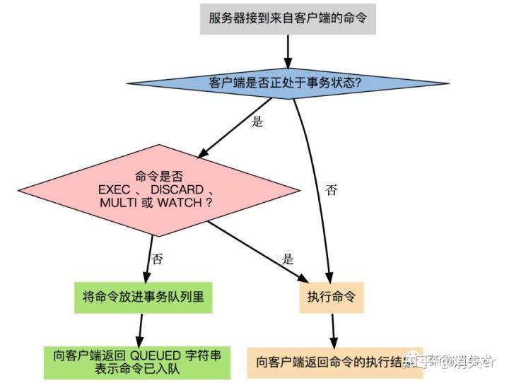

# 数据库06redis事务
## Redis 事务命令

下表列出了 redis 事务的相关命令：


序号	命令及描述

1	DISCARD 取消事务，放弃执行事务块内的所有命令。

2	EXEC 执行所有事务块内的命令。

3	MULTI 标记一个事务块的开始。

4	UNWATCH 取消 WATCH 命令对所有 key 的监视。

5	WATCH key [key ...] 监视一个(或多个) key ，如果在事务执行之前这个(或这些) key 被其他命令所改动，那么事务将被打断。


事务可以一次执行多个命令， 并且带有以下两个重要的保证：


事务是一个**单独的隔离操作**：事务中的所有命令都会序列化、按顺序地执行。事务在执行的过程中，不会被其他客户端发送来的命令请求所打断。

事务是一个**原子操作**：事务中的命令要么全部被执行，要么全部都不执行。

EXEC 命令负责触发并执行事务中的所有命令：

当使用 AOF 方式做持久化的时候， Redis 会使用单个 write(2) 命令将事务写入到磁盘中。

然而，如果 Redis 服务器因为某些原因被管理员杀死，或者遇上某种硬件故障，那么可能只有部分事务命令会被成功写入到磁盘中。

如果 Redis 在重新启动时发现 AOF 文件出了这样的问题，那么它会退出，并汇报一个错误。

使用 redis-check-aof 程序可以修复这一问题：它会移除 AOF 文件中不完整事务的信息，确保服务器可以顺利启动。


## 使用 check-and-set 操作实现乐观锁

WATCH 命令可以为 Redis 事务提供 check-and-set （CAS）行为。


被 WATCH 的键会被监视，并会发觉这些键是否被改动过了。 如果有至少一个被监视的键在 EXEC 执行之前被修改了， 那么整个事务都会被取消， EXEC 返回空多条批量回复（null multi-bulk reply）来表示事务已经失败。


举个例子， 假设我们需要原子性地为某个值进行增 1 操作（假设 INCR 不存在）。

```

WATCH mykey


val = GET mykey

val = val + 1


MULTI

SET mykey $val

EXEC

```


## Redis事务能回滚吗

如果一个事务中的命令出现了语法错误，大部分客户端驱动会返回错误，2.6.5 版本以上的 Redis 也会在执行 EXEC 时检查队列中的命令是否存在语法错误，如果存在，则会自动放弃事务(提前标记DISCARD)并返回错误。

但如果一个事务中的命令有非语法类的错误(比如对 String 执行 HSET 操作)，无论客户端驱动还是 Redis 都无法在真正执行这条命令之前发现，所以事务中的所有命令仍然会被依次执行。

在这种情况下，会出现一个事务中部分命令成功部分命令失败的情况，然而与 RDBMS 不同，Redis 不提供事务回滚的功能，所以只能通过其他方法进行数据的回滚。


## 在事务和非事务状态下执行命令



## 小结一：事务3阶段


开启：以MULTI 开启一个事务

入队：将多个命令入队到事务中，接到这些命令不会立即执行，而是放到等待执行的事务队列里面

执行：由EXEC命令触发事务


## 小结二：事务3特性


**单独的隔离操作**：事务中的所有命令都会序列化、按顺序地执行。事务在执行的过程中，不会被其他客户端发送来的命令请求所打断。

**没有隔离级别的概念**：队列中的命令没有提交之前都不会实际的被执行，因为事务提交前任何指令都不会被实际执行，也就不存在”事务内的查询要看到事务里的更新，在事务外查询不能看到”这个让人万分头痛的问题

**不保证原子性**：redis同一个事务中如果有一条命令执行失败，其后的命令仍然会被执行，没有回滚


## 参考
Redis的事务讲解：https://www.cnblogs.com/dwlovelife/p/10946868.html

你真的懂Redis事务吗？：https://cloud.tencent.com/developer/article/1189074

Redis事务,你真的了解吗：https://zhuanlan.zhihu.com/p/101902825?utm_source=wechat_session

https://www.redis.net.cn/tutorial/3502.html


