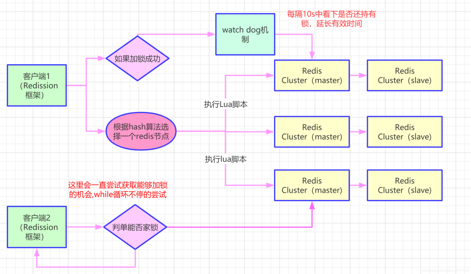
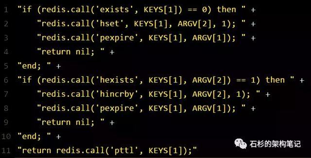
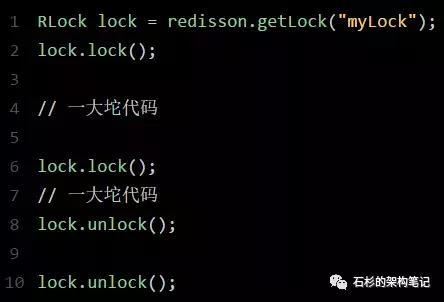
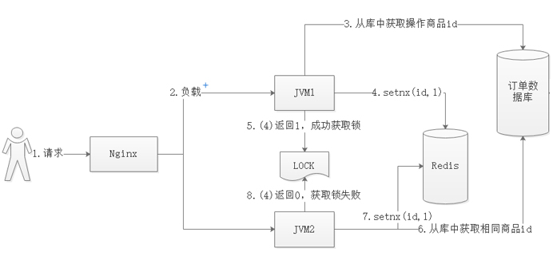
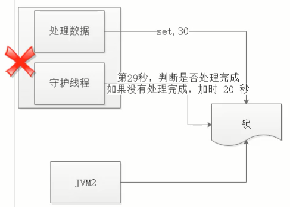

# 数据库07redis分布式锁
redis本身不处理分布bai式事物或者说它的du事物非常弱，因为zhiredis本身是单线程的；

之所以很多时候出现redis的线程安全问题是因为应用本身是分布式的；这块处理办法基本都是redis+lua解决分布式安全问题


## 分布式锁

先说说“线程锁”，线程锁大家都很熟悉，其使用环境大致可以描述为：如果有多个线程要同时访问某个共享资源的时候，我们可以采用线程间加锁的机制，即当某个线程获取到这个资源后，就立即对这个资源进行加锁，当使用完资源之后，再解锁，其它线程就可以接着使用了。

而分布式事务锁和线程锁锁大致意思相同，只不过其作用范围是“进程”之间。系统可能会有多份服务进程并且部署在不同的机器上，许多资源已经不是在线程之间共享了，而是属于进程之间共享的资源。所以，分布式事务锁可以描述为：是指在分布式的部署环境下，通过锁机制来让多客户端互斥的对共享资源进行访问。

实现分布式事务锁的方式有很多，但是市面上常用的技术就是 使用“数据库/redis”或zookeeper来实现。而核心的处理思路就是“获取锁”（写一条数据）、“删除锁”（删除这条数据）。其中使用“数据库“与”redis”的实现方式基本一样，咱们就只说如何使用redis实现分布式事务锁。


Redis为单进程单线程模式，采用队列模式将并发访问变成串行访问，且多客户端对Redis的连接并不存在竞争关系。


安全性：保证互斥，在任何时候，只有一个客户端可以持有锁

无死锁：即使当前持有锁的客户端崩溃或者从集群中被分开了，其它客户端最终总是能够获得锁。

容错性：只要大部分的 Redis 节点在线，那么客户端就能够获取和释放锁。


## 分布式锁的实现有哪些
1.Memcached分布式锁

利用Memcached的add命令。此命令是原子性操作，只有在key不存在的情况下，才能add成功，也就意味着线程得到了锁。

2.Redis分布式锁

和Memcached的方式类似，利用Redis的setnx命令。此命令同样是原子性操作，只有在key不存在的情况下，才能set成功。（setnx命令并不完善，后续会介绍替代方案）

3.Zookeeper分布式锁

利用Zookeeper的顺序临时节点，来实现分布式锁和等待队列。Zookeeper设计的初衷，就是为了实现分布式锁服务的。

4.Chubby

Google公司实现的粗粒度分布式锁服务，底层利用了Paxos一致性算法。


## Redis实现分布式锁
分布式锁实现的三个核心要素：
1.加锁

最简单的方法是使用setnx命令。key是锁的唯一标识，按业务来决定命名。比如想要给一种商品的秒杀活动加锁，可以给key命名为 “lock_sale_商品ID” 。而value设置成什么呢？我们可以姑且设置成1。加锁的伪代码如下：

setnx（key，1）

当一个线程执行setnx返回1，说明key原本不存在，该线程成功得到了锁；当一个线程执行setnx返回0，说明key已经存在，该线程抢锁失败。

2.解锁

有加锁就得有解锁。当得到锁的线程执行完任务，需要释放锁，以便其他线程可以进入。释放锁的最简单方式是执行del指令，伪代码如下：

del（key）

释放锁之后，其他线程就可以继续执行setnx命令来获得锁。

3.锁超时

锁超时是什么意思呢？如果一个得到锁的线程在执行任务的过程中挂掉，来不及显式地释放锁，这块资源将会永远被锁住，别的线程再也别想进来。
所以，setnx的key必须设置一个超时时间，以保证即使没有被显式释放，这把锁也要在一定时间后自动释放。setnx不支持超时参数，所以需要额外的指令，伪代码如下：

expire（key， 30）

综合起来，我们分布式锁实现的第一版伪代码如下：

```
if（setnx（key，1） == 1）{
    expire（key，30）
    try {
        do something ......
    } finally {
        del（key）
    }
}
```
存在着三个致命问题：

1. setnx和expire的非原子性

设想一个极端场景，当某线程执行setnx，成功得到了锁：

setnx刚执行成功，还未来得及执行expire指令，节点1 Duang的一声挂掉了。

这样一来，这把锁就没有设置过期时间，变得“长生不老”，别的线程再也无法获得锁了。

怎么解决呢？setnx指令本身是不支持传入超时时间的，幸好Redis 2.6.12以上版本为set指令增加了可选参数，伪代码如下：

set（key，1，30，NX）


2. del 导致误删

又是一个极端场景，假如某线程成功得到了锁，并且设置的超时时间是30秒。

如果某些原因导致线程A执行的很慢很慢，过了30秒都没执行完，这时候锁过期自动释放，线程B得到了锁。

随后，线程A执行完了任务，线程A接着执行del指令来释放锁。但这时候线程B还没执行完，**线程A实际上删除的是线程B加的锁**（A自己的锁由于超时被自动删了）。

怎么避免这种情况呢？可以在del释放锁之前做一个判断，验证当前的锁是不是自己加的锁。

至于具体的实现，可以在加锁的时候把当前的线程ID当做value，并在删除之前验证key对应的value是不是自己线程的ID。

这样就可以取代setnx指令。

```
加锁：
String threadId = Thread.currentThread().getId()
set（key，threadId ，30，NX）
解锁：
if（threadId .equals(redisClient.get(key))）{
    del(key)
}
```
但是，这样做又隐含了一个新的问题，判断和释放锁是两个独立操作，不是原子性。

我们都是追求极致的程序员，所以这一块要用Lua脚本来实现：

```
String luaScript = "if redis.call('get', KEYS[1]) == ARGV[1] then return redis.call('del', KEYS[1]) else return 0 end";
redisClient.eval(luaScript , Collections.singletonList(key), Collections.singletonList(threadId));
```
这样一来，验证和删除过程就是原子操作了。


3. 出现并发的可能性

还是刚才第二点所描述的场景，虽然我们避免了线程A误删掉key的情况，但是同一时间有A，B两个线程在访问代码块，仍然是不完美的。

怎么办呢？我们可以让获得锁的线程开启一个守护线程，用来给快要过期的锁“续航”。

当过去了29秒，线程A还没执行完，这时候守护线程会执行expire指令，为这把锁“续命”20秒。守护线程从第29秒开始执行，每20秒执行一次。

当线程A执行完任务，会显式关掉守护线程。

另一种情况，如果节点1 忽然断电，由于线程A和守护线程在同一个进程，守护线程也会停下。这把锁到了超时的时候，没人给它续命，也就自动释放了。


## Redisson实现Redis分布式锁的底层原理
Redisson这个开源框架对Redis分布式锁的实现原理。




（1）加锁机制

咱们来看上面那张图，现在某个客户端要加锁。如果该客户端面对的是一个redis cluster集群，他首先会根据hash节点选择一台机器。

这里注意，仅仅只是选择一台机器！这点很关键！

紧接着，就会发送一段lua脚本到redis上，那段lua脚本如下所示：




（2）锁互斥机制

那么在这个时候，如果客户端2来尝试加锁，执行了同样的一段lua脚本，会咋样呢？

很简单，第一个if判断会执行“exists myLock”，发现myLock这个锁key已经存在了。

接着第二个if判断，判断一下，myLock锁key的hash数据结构中，是否包含客户端2的ID，但是明显不是的，因为那里包含的是客户端1的ID。

所以，客户端2会获取到pttl myLock返回的一个数字，这个数字代表了myLock这个锁key的剩余生存时间。比如还剩15000毫秒的生存时间。

此时客户端2会进入一个while循环，不停的尝试加锁。


（3）watch dog自动延期机制

客户端1加锁的锁key默认生存时间才30秒，如果超过了30秒，客户端1还想一直持有这把锁，怎么办呢？

简单！只要客户端1一旦加锁成功，就会启动一个watch dog看门狗，他是一个后台线程，会每隔10秒检查一下，如果客户端1还持有锁key，那么就会不断的延长锁key的生存时间。

（4）可重入加锁机制

那如果客户端1都已经持有了这把锁了，结果可重入的加锁会怎么样呢？

比如下面这种代码：



那个myLock的hash数据结构中的那个客户端ID，就对应着加锁的次数


（5）释放锁机制

如果执行lock.unlock()，就可以释放分布式锁，此时的业务逻辑也是非常简单的。

其实说白了，就是每次都对myLock数据结构中的那个加锁次数减1。

如果发现加锁次数是0了，说明这个客户端已经不再持有锁了，此时就会用：

“del myLock”命令，从redis里删除这个key。

然后呢，另外的客户端2就可以尝试完成加锁了。

这就是所谓的分布式锁的开源Redisson框架的实现机制。

一般我们在生产系统中，可以用Redisson框架提供的这个类库来基于redis进行分布式锁的加锁与释放锁。


（6）上述Redis分布式锁的缺点

其实上面那种方案最大的问题，就是如果你对某个redis master实例，写入了myLock这种锁key的value，此时会异步复制给对应的master slave实例。
但是这个过程中一旦发生redis master宕机，主备切换，redis slave变为了redis master。

接着就会导致，客户端2来尝试加锁的时候，在新的redis master上完成了加锁，而客户端1也以为自己成功加了锁。

此时就会导致多个客户端对一个分布式锁完成了加锁。

这时系统在业务语义上一定会出现问题，导致各种脏数据的产生。

所以这个就是redis cluster，或者是redis master-slave架构的主从异步复制导致的redis分布式锁的最大缺陷：在redis master实例宕机的时候，可能导致多个客户端同时完成加锁。


原文链接：https://mp.weixin.qq.com/s?__biz=MzU0OTk3ODQ3Ng==&mid=2247483893&idx=1&sn=32e7051116ab60e41f72e6c6e29876d9&chksm=fba6e9f6ccd160e0c9fa2ce4ea1051891482a95b1483a63d89d71b15b33afcdc1f2bec17c03c&mpshare=1&scene=23&srcid=1121Vlt0Mey0OD5eYWt8HPyB#rd


## 错误加锁方式
错误方式一

保证互斥和防止死锁，首先想到的使用redis的setnx命令保证互斥，为了防止死锁，锁需要设置一个超时时间。

```
    public static void wrongLock(Jedis jedis, String key, String uniqueId, int expireTime) {
        Long result = jedis.setnx(key, uniqueId);
        if (1 == result) {
            //如果该redis实例崩溃，那就无法设置过期时间了
            jedis.expire(key, expireTime);
        }
    }

```
在多线程并发环境下，任何非原子性的操作，都可能导致问题。这段代码中，如果设置过期时间时，redis实例崩溃，就无法设置过期时间。如果客户端没有正确的释放锁，那么该锁(永远不会过期)，就永远不会被释放。


错误方式二

比较容易想到的就是设置值和超时时间为原子原子操作就可以解决问题。那使用setnx命令，将value设置为过期时间不就ok了吗？

```
    public static boolean wrongLock(Jedis jedis, String key, int expireTime) {
        long expireTs = System.currentTimeMillis() + expireTime;
        // 锁不存在，当前线程加锁成果
        if (jedis.setnx(key, String.valueOf(expireTs)) == 1) {
            return true;
        }

        String value = jedis.get(key);
        //如果当前锁存在,且锁已过期
        if (value != null && NumberUtils.toLong(value) < System.currentTimeMillis()) {
            //锁过期，设置新的过期时间
            String oldValue = jedis.getSet(key, String.valueOf(expireTs));
            if (oldValue != null && oldValue.equals(value)) {
                // 多线程并发下，只有一个线程会设置成功
                // 设置成功的这个线程，key的旧值一定和设置之前的key的值一致
                return true;
            }
        }
        // 其他情况，加锁失败
        return true;
    }

```
乍看之下，没有什么问题。但仔细分析，有如下问题：


value设置为过期时间，就要求各个客户端严格的时钟同步，这就需要使用到同步时钟。即使有同步时钟，分布式的服务器一般来说时间肯定是存在少许误差的。

锁过期时，使用 jedis.getSet虽然可以保证只有一个线程设置成功，但是不能保证加锁和解锁为同一个客户端，因为没有标志锁是哪个客户端设置的嘛。


## 错误解锁方式
解锁错误方式一

直接删除key

```
    public static void wrongReleaseLock(Jedis jedis, String key) {
        //不是自己加锁的key，也会被释放
        jedis.del(key);
    }
```
简单粗暴，直接解锁，但是不是自己加锁的，也会被删除，这好像有点太随意了吧！


解锁错误方式二

判断自己是不是锁的持有者，如果是，则只有持有者才可以释放锁。

```
    public static void wrongReleaseLock(Jedis jedis, String key, String uniqueId) {
        if (uniqueId.equals(jedis.get(key))) {
            // 如果这时锁过期自动释放，又被其他线程加锁，该线程就会释放不属于自己的锁
            jedis.del(key);
        }
    }
```
看起来很完美啊，但是如果你判断的时候锁是自己持有的，这时锁超时自动释放了。然后又被其他客户端重新上锁，然后当前线程执行到jedis.del(key)，这样这个线程不就删除了其他线程上的锁嘛，好像有点乱套了哦！

## 商品交易案例
### 分布式事务锁业务流程描述

一个系统中，有多个服务（jvm1、jvm2）同时对同一id的商品处理，其分布式事务锁流程如下所示：




### 实现方式

1、加锁

使用setnx命令，伪代码：setnx(id,value)。成功返回1，说明key不存在，线程抢锁成功。失败返回0，说明key已存在，线程抢锁失败。

注意：setnx(id,value)中key为操作商品的id，value用于存储进程编号与线程编号，用于解锁的时候防止误删。

2、解锁

使用del命令，伪代码：del(id)


### 问题分析

1、锁超时不删问题

描述：如果一个得到锁的线程在执行任务的过程中挂掉，来不及显式地释放锁，该资源将会被永远占用，其他线程将无法访问。

解决：为此，我们可以使用expire为key设置一个超时时间，与setnx命令一起执行（setnx不支持超时参数），用以保证即使未被显式释放，该锁也可在一定时间后自动释放。伪代码：

```
expire（key,value, 30）。
```
2、误删问题

描述：根据第一个“超时问题”，我们引申一下，假如，时间到了，任务没有执行完，另一个新的进程获取了锁，咋办？结合上图，咱们描述一个场景：

```
a、JVM1使用set(001, 002, 30)成功获取锁，并设置超时时间为30s；
b、JVM1开始数据处理，处理时间已经超过了30s...
c、服务器检测到(001, 002, 30)数据超时，将自动执行del进行数据删除，此时JVM1还在数据处理...
d、此时，JVM2使用set(001, 002, 30)成功获取锁，并设置超时时间为30s；
e、JVM2开始数据处理。与此同时，JVM1处理完成，操作提交后，根据商品id001，执行了del；
f、到此，JVM1成功误删了JVM2的锁。
```
误删了锁，咋办？jvm1线程明明还没有完成，结果，时间到期了，咋办？

解决：误删问题可以这样，加锁的时候，set(id, threadId,expire)，把value设为当前线程ID和进程的编号。执行del命令时，根据进程id和threadId数据判断该锁是否仍属于本线程。是，则删除。

遗留：jvm1线程明明还没有完成，结果，时间到期了，咋办？

3、基于误删锁的前提下，由于我们无法确定程序成功处理完成数据的具体时间，这就为超时时间的设置提出了难题。设置时间过长、过短都将影响程序并发的效率。

解决：守护线程，即为获取锁的锁的线程开启一个守护线程。当29秒时（或更早），线程A还没执行完，守护线程会执行expire指令，为这把锁“续命”20秒。守护线程从第29秒开始执行，每20秒执行一次。当线程A执行完任务，会显式关掉守护线程。如图：




4、守护线程挂了

这个问题是有上个问题引发的，如果守护现在挂了？上面的那些问题如何解决？虽然想法有点“极致”，但是，确实有可能发生，暂时还没有好的解决方案。


### 组件插件
在nuget上，有现成的redis分布式事务锁的包，咱们不用重复造轮子，可以直接下载下来用就行了：
各种版本的基本上都有：各类语言实现的分布式事务锁distlock。
DontNET基于Redis的分布式事务锁RedLock.net
基于sqlserver实现的分布式事务锁DistributedLock
### 尾语
最后的问题得不到完美的解决，恰巧说明了这中方式实现分布式事务锁有弊端，那么有没有没有一种完美的“分布式事务锁”的实现方案呢？有，参考我后面的文章：zookeeper实现分布式事务锁。


## 参考
Redis分布式事务锁实现:https://blog.csdn.net/wtopps/article/details/70768062

redis分布式锁---------redis分布式事务:https://www.cnblogs.com/weigy/p/12560455.html

redis怎么处理分布式事务的：https://zhidao.baidu.com/question/629220812958418764.html

Redis分布式锁的实现原理看这篇就够了~：https://blog.csdn.net/weixin_34117211/article/details/92422665

redis分布式锁，面试官请随便问，我都会：https://blog.csdn.net/chanllenge/article/details/102983597

分布式事务锁的实现-redis：zhifeiya.cn/post/分布式事务锁的实现-redis

漫画：什么是分布式锁？：https://mp.weixin.qq.com/s/8fdBKAyHZrfHmSajXT_dnA


