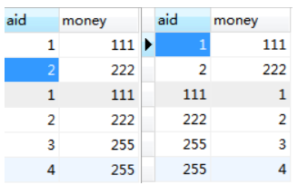

# 数据库10mysql之坑
## CONCAT字符串拼接
```
select CONCAT('I',' love',' money');  -- I love money
```

## INSERT（字符串，起始位置，长度，替换内容） 字符串替换，可用作脱敏
```
select INSERT('123456789',4,4,'****'); # 123****89
select INSERT('123456789',2,2,'**');   # 1**456789
```
## SUBSTRING（字符串，起始位置，长度）字符串截取
```
select SUBSTRING('123456789',1,4); #1234
select SUBSTRING('123456789',2,3); #234
```
## BETWEEN AND
函数包括左右边界，相当于>= 、<=。


## COUNT函数
```
SELECT COUNT(1) FROM t WHERE id<0; # 0
# count函数与group buy 组合使用，没有记录输出为null
SELECT COUNT(1) FROM t WHERE id<0 GROUP BY id; # NULL
```
## 计算两个日期之间的天数
```
# DAY 两个日期之间时间戳的差值/86400 ，其它的自己实践下哈
# SECOND/MINUTE/HOUR/DAY/MONTH/YEAR 以DAY为例
SELECT TIMESTAMPDIFF(DAY ,'2018-08-23','2018-08-31');# 8
SELECT TIMESTAMPDIFF(DAY ,'2018-08-23','2018-08-32');# NULL
```

## WHERE条件
1、正则匹配

```
# . 匹配字符串中的任意一个字符，包括回车和换行
# * 匹配多个该符号之前的字符，包含0和1个
# + 匹配多个该字符之前的字符，包括1个
SELECT * FROM table WHERE column REGEXP '^a[bcd]e{2,3}f.z$';
```

2.、NOT IN对NULL值的处理

```
SELECT * FROM `learn`; #[id,bro] => [1=>a,2=>b, 3=>null]
SELECT * FROM `learn` WHERE bro NOT IN ('a'); # [2=>b]
# 如果想要[2=>b,3=>null]
select * FROM learn WHERE bro NOT IN ('a') OR bro is NULL;
## ps: unique约束对null值无效，null值还会降低索引效率，所以无特殊情况，字段应设置为not null
```

## UNION / UNION ALL 数据合并时与单独子查询的字段名无关，与字段位置有关
```
# 对应下面第一个图
SELECT id as aid,money FROM test WHERE id<3
UNION ALL
SELECT id,money FROM test WHERE id<5;

# 对应下面第二个图
SELECT id as aid,money FROM test WHERE id<3
UNION ALL
SELECT money,id FROM test WHERE id<5;
```



## 行转列
大佬地址： https://www.cnblogs.com/ooo0/p/9085224.html


```
SELECT * FROM	property;
####结果如下####
id  name course score
1	张三	 数学	3
2	张三	 语文	4
3	张三	 英语	5
4	李四	 数学	6
5	李四	 语文	7
6	李四	 英语	8
7	王五	 数学	9
8	王五	 语文	10
9	王五	 英语	11
```
行转列sql

```
SELECT name,course,
MAX(CASE course WHEN '数学' THEN score ELSE 0 END) as '数学',
MAX(CASE course WHEN '语文' THEN score ELSE 0 END) as '语文',
MAX(CASE course WHEN '英语' THEN score ELSE 0 END) as '英语'
FROM `property` GROUP BY name;
####结果如下####
name course 数学 语文 英语
张三	 数学	3	 4	 5
李四	 数学	6	 7	 8
王五	 数学	9	 10	 11
```

中间sql，便于理解：

```
SELECT name,course,
CASE course WHEN '数学' THEN score ELSE 0 END as '数学',
CASE course WHEN '语文' THEN score ELSE 0 END as '语文',
CASE course WHEN '英语' THEN score ELSE 0 END as '英语'
FROM `property`;
####结果如下####
name course 数学 语文 英语
张三  数学	3	0	0
张三	 语文	0	4	0
张三	 英语	0	0	5
李四	 数学	6	0	0
李四	 语文	0	7	0
李四	 英语	0	0	8
王五	 数学	9	0	0
王五	 语文	0	10	0
王五	 英语	0	0	11
```
## 表中文乱码问题
在建表的时候额外执行

```
ALTER TABLE camera CONVERT TO CHARACTER SET utf8;　
```

## MySQL的utf8编码坑
曾几何时，每次建库都选utf8，觉得自己比那些用乱七八糟编码的人不知道酷到哪里去了。直到好多年前的某次课程设计做项目的时候，愉快的建了个用户表：

```
CREATE TABLE `test_user` (
  `id` int(11) unsigned NOT NULL AUTO_INCREMENT,
  `name` varchar(32) DEFAULT NULL,
  PRIMARY KEY (`id`)
) ENGINE=InnoDB DEFAULT CHARSET=utf8;
```
然后愉快的新增用户：INSERT INTO test_user(name) VALUES("我是")，接着愉快的反思人生：

```
Incorrect string value: '\xF0\x9F\x98\x81' for column 'name' at row 1
```
我是谁？我来自哪里？我在干嘛？难道是我代码里面的字符集用错了？不对啊我所有地方都用的utf8啊……


**MySQL的UTF8编码是什么**？

首先来看官方文档：

```
The character set named utf8 uses a maximum of three bytes per character and contains only BMP characters. The utf8mb4 character set uses a maximum of four bytes per character supports supplementary characters:
For a BMP character, utf8 and utf8mb4 have identical storage characteristics: same code values, same encoding, same length.
For a supplementary character, utf8 cannot store the character at all, whereas utf8mb4 requires four bytes to store it. Because utf8 cannot store the character at all, you have no supplementary characters in utf8 columns and need not worry about converting characters or losing data when upgrading utf8 data from older versions of MySQL.
```
我们再看看维基百科对UTF8编码的解释：

```
UTF-8 is a variable width character encoding capable of encoding all 1,112,064 valid code points in Unicode using one to four 8-bit bytes.
```
可以看出，**MySQL中的utf8实质上不是标准的UTF8**。MySQL中，utf8对每个字符最多使用三个字节来表示.

“utf8”只支持每个字符最多三个字节，而真正的UTF-8是每个字符最多四个字节。

MySQL一直没有修复这个bug，他们在2010年发布了一个叫作“utf8mb4”的字符集，绕过了这个问题。

当然，他们并没有对新的字符集广而告之（可能是因为这个bug让他们觉得很尴尬），以致于现在网络上仍然在建议开发者使用“utf8”，但这些建议都是错误的。

简单概括如下：

1.MySQL的“utf8mb4”是真正的“UTF-8”。

2.MySQL的“utf8”是一种“专属的编码”，它能够编码的Unicode字符并不多。

我要在这里澄清一下：所有在使用“utf8”的MySQL和MariaDB用户都应该改用“utf8mb4”，永远都不要再使用“utf8”。

这里https://mathiasbynens.be/notes/mysql-utf8mb4#utf8-to-utf8mb4 提供了一个指南用于将现有数据库的字符编码从“utf8”转成“utf8mb4”。


## left-join常见的坑(数据不足和冗余)
```
mysql> select * from role;
+----+-----------+
| id | role_name |
+----+-----------+
| 1 | 管理员 |
| 2 | 总经理 |
| 3 | 科长 |
| 4 | 组长 |
+----+-----------+
4 rows in set (0.00 sec)
 
mysql> select * from user;
+----+---------+-----------+------+
| id | role_id | user_name | sex |
+----+---------+-----------+------+
| 1 | 1 | admin | 1 |
| 2 | 2 | 王经理 | 1 |
| 3 | 2 | 李经理 | 2 |
| 4 | 2 | 张经理 | 2 |
| 5 | 3 | 王科长 | 1 |
| 6 | 3 | 李科长 | 1 |
| 7 | 3 | 吕科长 | 2 |
| 8 | 3 | 邢科长 | 1 |
| 9 | 4 | 范组长 | 2 |
| 10 | 4 | 赵组长 | 2 |
| 11 | 4 | 姬组长 | 1 |
+----+---------+-----------+------+
11 rows in set (0.00 sec)
```
基本业务

简单信息报表: 查询用户信息

```
mysql> SELECT
-> id,
-> user_name AS '姓名',
-> ( CASE WHEN sex = 1 THEN '男' WHEN sex = 2 THEN '女' ELSE '未知' END ) AS '性别'
-> FROM
-> USER;
+----+-----------+--------+
| id | 姓名 | 性别 |
+----+-----------+--------+
| 1 | admin | 男 |
| 2 | 王经理 | 男 |
| 3 | 李经理 | 女 |
| 4 | 张经理 | 女 |
| 5 | 王科长 | 男 |
| 6 | 李科长 | 男 |
| 7 | 吕科长 | 女 |
| 8 | 邢科长 | 男 |
| 9 | 范组长 | 女 |
| 10 | 赵组长 | 女 |
| 11 | 姬组长 | 男 |
+----+-----------+--------+
```
查询每个角色名称及对应人员中女性数量

```
mysql> SELECT
-> r.id,
-> r.role_name AS role,
-> count( u.sex ) AS sex
-> FROM
-> role r
-> LEFT JOIN USER u ON r.id = u.role_id
-> AND u.sex = 2
-> GROUP BY
-> r.role_name
-> ORDER BY
-> r.id ASC;
+----+-----------+-----+
| id | role | sex |
+----+-----------+-----+
| 1 | 管理员 | 0 |
| 2 | 总经理 | 2 |
| 3 | 科长 | 1 |
| 4 | 组长 | 2 |
+----+-----------+-----+
4 rows in set (0.00 sec)
```

假如我们把性别过滤的条件改为 where 操作结果会怎么样呢？

```
mysql> SELECT
-> r.id,
-> r.role_name AS role,
-> count( u.sex ) AS sex
-> FROM
-> role r
-> LEFT JOIN USER u ON r.id = u.role_id
-> WHERE
-> u.sex = 2
-> GROUP BY
-> r.role_name
-> ORDER BY
-> r.id ASC;
+----+-----------+-----+
| id | role | sex |
+----+-----------+-----+
| 2 | 总经理 | 2 |
| 3 | 科长 | 1 |
| 4 | 组长 | 2 |
+----+-----------+-----+
3 rows in set (0.00 sec)
```
这里可以看到角色数据不完整了。(虽然数据并没错,但是数据显然是残缺的,**虽然是0但却是有意义的,不应该自动隐藏掉**)


找出角色为总经理的员工数量

```
mysql> SELECT
-> r.id,
-> r.role_name AS role,
-> count( u.sex ) AS sex
-> FROM
-> role r
-> LEFT JOIN USER u ON r.id = u.role_id
-> WHERE
-> r.role_name = '总经理'
-> GROUP BY
-> r.role_name
-> ORDER BY
-> r.id ASC;
+----+-----------+-----+
| id | role | sex |
+----+-----------+-----+
| 2 | 总经理 | 3 |
+----+-----------+-----+
1 row in set (0.00 sec)
```
同样将过滤条件由 where 改为 on

```
mysql> SELECT
-> r.id,
-> r.role_name AS role,
-> count( u.sex ) AS sex
-> FROM
-> role r
-> LEFT JOIN USER u ON r.id = u.role_id
-> AND r.role_name = '总经理'
-> GROUP BY
-> r.role_name
-> ORDER BY
-> r.id ASC;
+----+-----------+-----+
| id | role | sex |
+----+-----------+-----+
| 1 | 管理员 | 0 |
| 2 | 总经理 | 3 |
| 3 | 科长 | 0 |
| 4 | 组长 | 0 |
+----+-----------+-----+
4 rows in set (0.00 sec)
```
这里可以看到数据多余了


总结:在 left join 语句中，**左表过滤必须放 where 条件中，右表过滤必须放 on 条件中**，这样结果才能不多不少，刚刚好。

类似案例参考:left join 注意事项


## 任何字段与null比较，结果都是false(即使是null与null比较)
多个字段关联查询时，如果其中一个字段为null，关联结果就是false，比如null = null and 1 = 1。

在写多字段关联的sql时，需要结合业务场景，考虑当其中一个字段为null时，本次关联还生不生效。

比如a和b都是学生表，两个表都有s_id（学生id）和c_id（班级id）列，求两个表共同的学生（学生id和班级id同时相等时，判定为同一个学生），sql为:

```
select * from a, b where a.s_id = b.s_id and a.c_id = c.c_id
```
假如有一个学生，在a、b表都存在，但是c_id为空（比如该学生未排到具体班级），那么上面的sql就会漏掉该学生，需要把sql调整为:

```
select * from a, b 
where 
((a.c_id is null and b.c_id is null) or a.c_id = b.c_id)
and a.s_id = c.s_id
```

## 联合索引的最左匹配原则

## IN子句逻辑问题
这个是在给同事调BUG时发现的,展示之前先初始化一些数据.

```
create table mysql_pitfalls(
c1 int,
c2 varchar(128),
c3 datetime,
c4 timestamp
);

-- 插入测试数据
insert into mysql_pitfalls(c1,c2,c3,c4) values(1,'1',now(),now());
insert into mysql_pitfalls(c1,c2,c3,c4) values(2,'2',now(),now());
insert into mysql_pitfalls(c1,c2,c3,c4) values(3,'3',now(),now());
insert into mysql_pitfalls(c1,c2,c3,c4) values(4,'4',now(),now());
```
下面我们分别执行以下两条SQL

```
mysql> select * from mysql_pitfalls where c1 in (1,2,3);  
+------+------+---------------------+---------------------+
| c1   | c2   | c3                  | c4                  |
+------+------+---------------------+---------------------+
|    1 | 1    | 2015-06-06 19:00:05 | 2015-06-06 19:00:05 |
|    2 | 2    | 2015-06-06 19:00:08 | 2015-06-06 19:00:08 |
|    3 | 3    | 2015-06-06 19:00:11 | 2015-06-06 19:00:11 |
+------+------+---------------------+---------------------+
3 rows in set (0.00 sec)
```
这条SQL很简单,C1列是数值型的,IN逻辑正确．接下面再看一句有逻辑问题的查询，去IN一个字符串-- 瞬间就被玩坏了

```
mysql> select * from mysql_pitfalls where c1 in ('1,2,3');
+------+------+---------------------+---------------------+
| c1   | c2   | c3                  | c4                  |
+------+------+---------------------+---------------------+
|    1 | 1    | 2015-06-06 19:00:05 | 2015-06-06 19:00:05 |
+------+------+---------------------+---------------------+
1 row in set, 1 warning (0.00 sec)
```

同样是数值型C1列,查询如果IN的条件是一个带逗号的字符串,IN条件会错误命中字符串中第一个逗号之前的数字.虽然这条SQL写错了,但这本身算是一个逻辑错误:明明不相等,IN去处怎么能匹配成功呢.再者,由于错误返回了每一条数据,有时候会麻痹开发和测试，误认为功能没有问题.PS: 可以试试执行IN ('1,2,3','2,3,4'), 会发现MySQL会求每一个带逗号字符串的第一个值.


## 更新时，表无法做为条件嵌套引用
我们尝试从表中删除一行时间最大的列，其实可选的方法不少．但如果采用下面的语句，会抛出异常

```
mysql> delete from mysql_pitfalls where c4 = ( select max(c4) d from mysql_pitfalls);
ERROR 1093 (HY000): You can't specify target table 'mysql_pitfalls' for update in FROM clause
```
如果只是想删除最大一行的话，绕开的方法不少，也不算上让人郁闷．但最让人郁闷的是，其它这条SQL稍微改造，再嵌套一层使子查询彻底变成内存表就可以使用了，而MySQL自身并没有做这样的优化--　再嵌套一层就可以正常使用了

```
mysql> delete from mysql_pitfalls where c4 =
(select max(d) from ( select max(c4) d from mysql_pitfalls) a );
Query OK, 1 row affected (0.04 sec)
```
当然，这只能算＂体验＂问题．


## Group By: 选取非分组列
这个可能是我遇到第一个让人奇怪的功能，算起来，这可能不算做＂坑＂，而更像是MySQL的特色．

在其它关系型数据库中，在拥Group By子句的情况下，只能select出被分组的列，对于非分组的列，除非使用聚合函数，这列将无法选择，原理也很简单，画一个二维表就能明白．但是在MySQL中，即使在Select中选择了非分组，MySQL也不会抛出语法错误，而是会默认选择这一组中这列的最后一个值．

从一方面来讲，这个功能提供了很多的灵活性．但另一方面，由于这个过程是静默，不会提示．会对开发和测试造成一定程度的麻痹（这种SQL不符合严谨的逻辑），而且造成了程序的不确定性． 这个功能可以通过显式修改MySQL运行模式，变得和普通RDBMS一致: MySQL ::   MySQL 5.5 Reference Manual :: 5.1.7 Server SQL Modes


## MySQL时间加减的正确打开方式
研发sql：update table set time = time + 1 where id=1;

看似好像挺对的，但是偶尔会出现不是想要的结果。


正确方式

```
为日期加上一个时间间隔：date_add()
date_add(@dt, interval 1 microsecond); -加1毫秒
date_add(@dt, interval 1 second); -加1秒 
date_add(@dt, interval 1 minute); -加1分钟  
date_add(@dt, interval 1 hour); -加1小时  
date_add(@dt, interval 1 day); -加1天 
date_add(@dt, interval 1 week); -加1周  
date_add(@dt, interval 1 month); -加1月  
date_add(@dt, interval 1 quarter); -加1季  
date_add(@dt, interval 1 year); -加1年  
```
为日期减去一个时间间隔：date_sub()，格式同date_add()


## INT长度并不能指定
常见的int(4)并不是指最大存储9999，而是低于4位的数字会使用空格或0在左侧补齐到4位。这个4是显示宽度。

int实际上是定长字段，占用4字节。取值范围固定是-(231-1) ~ (231-1) ,无符号时为0 ~ (232-1)。


## VARCHAR存储的是字符而不是字节，但最大长度是另外的算法
VARCHAR声明的是字符数，但存储的是字节。

理论上最大长度是65535 bytes，但实际上往往达不到。因为有几个因素：

65535是单行数据的最大值，实际上除了varchar，表里应该还会有其他字段

varchar存放的字符串，往往会有多字节字符、一个字符占多个字节，而我们前端展现计算长度往往用的是字符数，所以也肯定达不到65535

varchar字段有长度标识位，可能占用1~2个字节，与我们声明的字段长度、字符集单字符最大长度有关，换算关系比较复杂，一句话说不清楚。


## 自增不一定连续，还可能重复
首先传递一个逻辑，MySQL InnoDB的自增，是使用了一个表级的计数器。

自增不一定连续：如果insert或update指定了比当前最大值更大的值，计数器会直接增加到新的最大值；如果delete已有的一行数据，计数器并不会减小。

自增可能重复：上面提到的计数器，是维护在内存中的，MySQL一旦重启、又没有手工重新装载过计数器，新插入记录自增主键就会重新从最小值开始，就会出现重复。(**现实中好像不需要这么做吧，所以这个应该不可信**)


## TIMESTAMP只能表达68年
TIMESTAMP以4字节整数（可看做SIGNED INT）存储从1970-01-01T00:00:00Z（UNIX纪元）经过的秒数。UNIX纪元看做0值，小于纪元的时间插入会报错。

有符号4字节可以表达最大绝对值为2^31-1的数字，所以TIMESTAMP的只能表达1970-01-01T00:00:01Z ~ 2038-01-19T03:14:07Z的范围。


## 参考
MySQL各种套路统计/坑/小知识点:https://blog.csdn.net/qq_30923243/article/details/85002269

【MySQL】各种小坑-持续更新:https://www.cnblogs.com/Ryan16231112/p/11849448.html

MySQL联表查询基本操作之left-join常见的坑:www.cppcns.com/shujuku/mysql/313570.html

经验总结：被MySQL UTF8编码坑的惨痛教训:https://www.eet-china.com/mp/a17039.html

说一个MySQL里可能人人都会遇到的坑:https://cloud.tencent.com/developer/article/1478057

mysql sql语句常见踩坑点：https://www.jianshu.com/p/c72275728520

left join 注意事项(where条件和on条件差别)：https://www.jianshu.com/p/d0f9b3c75b0d

你遇到过哪些MySQL的坑？：https://www.zhihu.com/question/22108510

MySQL时间加减的正确打开方式：https://cloud.tencent.com/developer/article/1056404

初学者必看的MySQL坑：www.suoniao.com/article/5ea77f1244558d4a860517d6

mysql数据库里的一些坑(读高性能mysql有感)：https://blog.csdn.net/weixin_33816300/article/details/88908604

