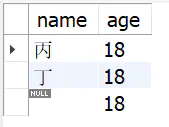

# 数据库11mysql之坑null专题
## 空值” 和 “NULL” 的概念
首先，我们要搞清楚“空值” 和 “NULL” 的概念：

1、空值是不占用空间的

2、mysql中的NULL其实是占用空间的，下面是来自于MYSQL官方的解释

```
“NULL columns require additional space in the row to record whether their values are NULL. For MyISAM tables, each NULL column takes one bit extra, rounded up to the nearest byte.”  
```

## 数字+null = null 被气成傻逼
where 必须使用 is null 使用 = null 直接无效，问题是还不报错

null 各种神奇的设定，只此一条就被气成傻逼


## count(column)不会统计所有行
count(column)会忽略掉值为NULL的行，相比于count(*)或count(1)，统计出来的数字可能会小一些。从性能角度也不建议使用列。


## mysql not in 丢失数据
all_student表是所有的学生信息，fail_student表是不及格的学生信息

```
select * from all_student
```


```
select * from fail_student
```


查询及格的学生信息

```
select * from all_student
where name not in (
select name from fail_student
)
```


假如fail_student有一条name为null的记录




再次查询及格的学生信息，结果集为空
```
select * from all_student
where name not in (
select name from fail_student
)
```


解决方案

修改表结构，设置name字段为not null，并设置默认值

IFNULL 函数: SELECT IFNULL(a,0) FROM table WHERE 1;


## MySQL中NOT IN填坑之列为null的问题解决
SQL 中任意 !=null 的运算结果都是 false，所以如果 t2 中存在一个 null，not in 的查询永远都会返回 false，即查询结果为空。

```
select COUNT(*) from t1 where t1.c1 not in (
select t2.c1 from t2 where t2.c1 is not null AND t2.c1 != ''
);
```
所以都是 null 引起的（为了避免错误我把空串也加上了），原因是 not in 的实现原理是，对每一个 t1.c1 和每一个 t2.c1 （括号内的查询结果）进行不相等比较（!=）。

```
foreach c1 in t2:
if t1.c1 != c1:
continue
else:
return false
return true
```
而 SQL 中任意 !=null 的运算结果都是 false，所以如果 t2 中存在一个 null，not in 的查询永远都会返回 false，即查询结果为空。


## 查询运算符、like、between and、in、not in对NULL值查询不起效。
带有条件的查询，对字段b进行条件查询的，b的值为NULL的都没有出现。

对c字段进行like '%'查询、in、not查询，c中为NULL的记录始终没有查询出来。

between and查询，为空的记录也没有查询出来。

结论：查询运算符、like、between and、in、not in对NULL值查询不起效。


那NULL如何查询呢？

IS NULL/IS NOT NULL（NULL值专用查询）

上面介绍的各种运算符对NULL值均不起效，mysql为我们提供了查询空值的语法：IS NULL、IS NOT NULL。


## MySQL中IS NULL、IS NOT NULL、!=不能用索引？胡扯！
MySQL中决定使不使用某个索引执行查询的依据很简单：就是成本够不够小。而不是是否在WHERE子句中用了IS NULL、IS NOT NULL、!=这些条件。大家以后也多多辟谣吧，没那么复杂，只是一个成本而已。

## 总结
1：NULL作为布尔值的时候，不为1也不为0

2：任何值和NULL使用运算符（>、<、>=、<=、!=、<>）或者（in、not in、any/some、all），返回值都为NULL

3：当IN和NULL比较时，无法查询出为NULL的记录

4：当NOT IN 后面有NULL值时，不论什么情况下，整个sql的查询结果都为空

5：判断是否为空只能用IS NULL、IS NOT NULL

6：count(字段)无法统计字段为NULL的值，count(*)可以统计值为null的行

7：当字段为主键的时候，字段会自动设置为not null

8：NULL导致的坑让人防不胜防，强烈建议创建字段的时候字段不允许为NULL，给个默认值


## 参考
mysql not in 丢失数据：https://www.jianshu.com/p/5898e54cdec9

MySQL中NOT IN填坑之列为null的问题解决：www.111com.net/database/180180.htm

关于mysql的null相关查询的一些坑：https://www.cnblogs.com/mr-wuxiansheng/p/11578881.html

MySQL中避免NULL的坑：https://blog.csdn.net/weixin_43894879/article/details/106306608

MySQL中IS NULL、IS NOT NULL、!=不能用索引？胡扯！：https://blog.csdn.net/lonely_bin/article/details/99715968  