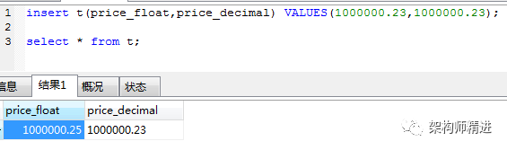

# 数据库12经验之谈
## 自增主键用完了怎么办?
在mysql中，Int整型的范围（-2147483648~2147483648），约20亿！因此不用考虑自增ID达到最大值这个问题。而且数据达到千万级的时候就应该考虑分库分表了。


## 主键为什么不推荐有业务含义?
最好是主键是无意义的自增ID，然后另外创建一个业务主键ID，

因为任何有业务含义的列都有改变的可能性,主键一旦带上了业务含义，那么主键就有可能发生变更。**主键一旦发生变更，该数据在磁盘上的存储位置就会发生变更，有可能会引发页分裂，产生空间碎片**。

还有就是，带有**业务含义的主键，不一定是顺序自增的。那么就会导致数据的插入顺序，并不能保证后面插入数据的主键一定比前面的数据大**。如果出现了，后面插入数据的主键比前面的小，就有可能引发页分裂，产生空间碎片。


## 货币字段用什么类型?
货币字段一般都用 Decimal类型，

float和double是以二进制存储的，数据大的时候，可能存在误差。看下面这个图就明白了 ：




## 时间字段用什么类型?
这个看具体情况和实际场景，timestamp ，datatime ，bigint 都行！把理由讲清楚就行！

timestamp，该类型是四个字节的整数，它能表示的时间范围为1970-01-01 08:00:01到2038-01-19 11:14:07。2038年以后的时间，是无法用timestamp类型存储的。

但是它有一个优势，timestamp类型是带有时区信息的。一旦你系统中的时区发生改变，例如你修改了时区，该字段的值会自动变更。这个特性用来做一些国际化大项目，跨时区的应用时，特别注意！

datetime，占用8个字节，它存储的时间范围为1000-01-01 00:00:00 ~ 9999-12-31 23:59:59。显然，存储时间范围更大。但是它坑的地方在于，它存储的是时间绝对值，不带有时区信息。如果你改变数据库的时区，该项的值不会自己发生变更！

bigint，也是8个字节，自己维护一个时间戳，查询效率高，不过数据写入，显示都需要做转换。


## 为什么不直接存储图片、音频、视频等大容量内容?
我们在实际应用中，都是文件形式存储的。mysql中，只存文件的存放路径。虽然mysql中blob类型可以用来存放大容量文件，但是，我们在生产中，基本不用！

主要有如下几个原因：

```
1. Mysql内存临时表不支持TEXT、BLOB这样的大数据类型，如果查询中包含这样的数据，查询效率会非常慢。
2. 数据库特别大，内存占用高，维护也比较麻烦。
3. binlog太大，如果是主从同步的架构，会导致主从同步效率问题！
```
因此，不推荐使用blob等类型！


## 表中有大字段X(例如：text类型)，且字段X不会经常更新，以读为主，那么是拆成子表好？还是放一起好？
其实各有利弊，拆开带来的问题：连接消耗；不拆可能带来的问题：查询性能，所以要看你的实际情况，如果表数据量比较大，最好还是拆开为好。这样查询速度更快。


## 字段为什么要定义为NOT NULL?
一般情况，都会设置一个默认值，不会出现字段里面有null，又有空的情况。主要有以下几个原因：

1. 索引性能不好，Mysql难以优化引用可空列查询，它会使索引、索引统计和值更加复杂。可空列需要更多的存储空间，还需要mysql内部进行特殊处理。可空列被索引后，每条记录都需要一个额外的字节，还能导致MYisam 中固定大小的索引变成可变大小的索引。

2. 如果某列存在null的情况，可能导致count() 等函数执行不对的情况。看一下2个图就明白了：

3. sql 语句写着也麻烦，既要判断是否为空，又要判断是否为null等。


## where执行顺序是怎样的？
where 条件**从左往右**执行的，在数据量小的时候不用考虑，但数据量多的时候要考虑条件的先后顺序，此时应遵守一个原则：**排除越多的条件放在第一个**。


## 应该在这些列上创建索引：
在经常需要**搜索的列**上，可以加快搜索的速度；在作为**主键的列**上，强制该列的唯一性和组织表中数据的排列结构；在经常用在**连接的列**上，这些列主要是一些外键，可以加快连接的速度；在经常需要根据**范围进行搜索**的列上创建索引，因为索引已经排序，其指定的范围是连续的；在经常需要**排序的列**上创建索引，因为索引已经排序，这样查询可以利用索引的排序，加快排序查询时间；在经常使用在**WHERE子句中的列**上面创建索引，加快条件的判断速度。

## 什么是最左前缀原则？
最左前缀原则指的是，如果查询的时候查询条件精确匹配索引的左边连续一列或几列，则此列就可以被用到。如下：
```
select * from user where name=xx and city=xx ; ／／可以命中索引
select * from user where name=xx ; // 可以命中索引
select * from user where city=xx ; // 无法命中索引
```
这里需要注意的是，查询的时候如果两个条件都用上了，但是顺序不同，如 city= xx and name ＝xx，那么现在的查询引擎会自动优化为匹配联合索引的顺序，这样是能够命中索引的。

由于最左前缀原则，在创建联合索引时，索引字段的顺序需要考虑**字段值去重之后的个数，较多的放前面**。ORDER BY子句也遵循此规则。


## 什么情况下应不建或少建索引
表记录太少

经常插入、删除、修改的表

数据重复且分布平均的表字段，假如一个表有10万行记录，有一个字段A只有T和F两种值，且每个值的分布概率大约为50%，那么对这种表A字段建索引一  般不会提高数据库的查询速度。

经常和主字段一块查询但主字段索引值比较多的表字段


## 问了下MySQL数据库cpu飙升到100%的话他怎么处理？
1. 列出所有进程 show processlist 观察所有进程 多秒没有状态变化的(干掉)

2. 查看慢查询，找出执行时间长的sql；explain分析sql是否走索引，sql优化；

3. 检查其他子系统是否正常，是否缓存失效引起，需要查看buffer命中率；


## 索引是个什么样的数据结构呢?
索引的数据结构和具体存储引擎的实现有关, 在MySQL中使用较多的索引有Hash索引,B+树索引等,而我们经常使用的InnoDB存储引擎的默认索引实现为+树索引.

## Hash索引和B+树所有有什么区别或者说优劣呢?
首先要知道Hash索引和B+树索引的底层实现原理:

hash索引底层就是hash表,进行查找时,调用一次hash函数就可以获取到相应的键值,之后进行回表查询获得实际数据.B+树底层实现是多路平衡查找树.对于每一次的查询都是从根节点出发,查找到叶子节点方可以获得所查键值,然后根据查询判断是否需要回表查询数据.

那么可以看出他们有以下的不同:

hash索引进行等值查询更快(一般情况下),但是却无法进行范围查询.

因为在hash索引中经过hash函数建立索引之后,索引的顺序与原顺序无法保持一致,不能支持范围查询.而B+树的的所有节点皆遵循(左节点小于父节点,右节点大于父节点,多叉树也类似),天然支持范围.

hash索引不支持使用索引进行排序,原理同上.

hash索引不支持模糊查询以及多列索引的最左前缀匹配.原理也是因为hash函数的不可预测.AAAA和AAAAB的索引没有相关性.

hash索引任何时候都避免不了回表查询数据,而B+树在符合某些条件(聚簇索引,覆盖索引等)的时候可以只通过索引完成查询.

hash索引虽然在等值查询上较快,但是不稳定.性能不可预测,当某个键值存在大量重复的时候,发生hash碰撞,此时效率可能极差.而B+树的查询效率比较稳定,对于所有的查询都是从根节点到叶子节点,且树的高度较低.

因此,在大多数情况下,直接选择B+树索引可以获得稳定且较好的查询速度.而不需要使用hash索引.


## 那么在哪些情况下会发生针对该列创建了索引但是在查询的时候并没有使用呢?
使用不等于查询,

列参与了数学运算或者函数

在字符串like时左边是通配符.类似于'%aaa'.

当mysql分析全表扫描比使用索引快的时候不使用索引.

当使用联合索引,前面一个条件为范围查询,后面的即使符合最左前缀原则,也无法使用索引.

以上情况,MySQL无法使用索引.


## 为什么使用数据索引能提高效率
数据索引的存储是有序的

在有序的情况下，通过索引查询一个数据是无需遍历索引记录的

极端情况下，数据索引的查询效率为二分法查询效率，趋近于 log2(N)

## B+树索引和哈希索引的区别
参考文献：mysql 常见面试题 转载 附录

## 哈希索引的优势
参考文献：mysql 常见面试题 转载 附录

## B树和B+树的区别
参考文献：mysql 常见面试题 转载 附录

## 为什么说B+比B树更适合实际应用中操作系统的文件索引和数据库索引？
参考文献：mysql 常见面试题 转载 附录


## 其他
2.主键自增id适合设置为无符号的int类型，这样最大值可以增加一倍：4294967295(2的32次方减一)。

5.char类型存储的数据长度小于最大长度时会用空格填充，检索时再剔除，因此如果存入的string最后有空格，查询出来是没有的。

7.时间戳格式timestamp和datetime，前者占用空间小（4bytes）且与时区相关，优先使用。除非是范围超过了timestamp的范围（1970~2038），不推荐使用int类型。

10.IPv4地址可以保存为无符号int类型，因为它实际上是一个32位的无符号整数，使用mysql函数（INET_ATON和INET_NTOA）进行转换。

11.范式与反范式的使用并不是绝对性的，需要根据自己的业务和数据量合理折中使用。数据量大查询频率高的时候适当的建立冗余字段减少关联，而数据少关联紧密的场合遵循范式化设计。

12.sql中limit 5表示搜索前五条记录，limit 5,10检索6-10条记录，limit 5,-1表示6-last条记录。


## MySQL 军规
基础规范

**必须使用 InnoDB 存储引擎**

解读：支持事务、行级锁、并发性能更好、CPU及内存缓存页优化使得资源利用率更高。


**表字符集默认使用 utf8，必要时候使用 utf8mb4**

解读：万国码，无需转码，无乱码风险，节省空间，utf8mb4 是 utf8 的超集，有存储4字节例如表情符号时，使用它。


**数据表、数据字段必须加入中文注释**


**禁止使用存储过程、视图、触发器、Event**

解读：高并发大数据的互联网业务，架构设计思路是“解放数据库 CPU，将计算转移到服务层”，并发量大的情况下，这些功能很可能将数据库拖死，业务逻辑放到服务层具备更好的扩展性，能够轻易实现“增机器就加性能”。数据库擅长存储与索引，CPU 计算还是上移吧。


**禁止存储大文件或者大照片**

解读：为何要让数据库做它不擅长的事情？大文件和照片存储在文件系统，数据库里存 URI 多好。


**控制单表数据量，单表记录控制在千万级**


**平衡范式与冗余，为提高效率可以牺牲范式设计，冗余数据**


命名规范

线上环境、开发环境、测试环境数据库内网域名遵循命名规范

```
业务名称：xxx
线上环境：dj.xxx.db
开发环境：dj.xxx.rdb
测试环境：dj.xxx.tdb
```
库名、表名、字段名：小写，下划线风格，不超过32个字符，必须见名知意，禁止拼音英文混用

表名 t_xxx，非唯一索引名 idx_xxx，唯一索引名 uniq_xxx


表设计规范

**单表列数目必须小于30**


**表必须有主键，例如自增主键，推荐使用 UNSIGNED 整数为主键**

解读：

主键递增，数据行写入可以提高插入性能，可以避免 page 分裂，减少表碎片，提升空间和内存的使用；

主键要选择较短的数据类型，InnoDB 引擎普通索引都会保存主键的值，较短的数据类型可以有效的减少索引的磁盘空间，提高索引的缓存效率；

无主键的表删除，在 row 模式的主从架构，会导致备库夯住；


**禁止使用外键，如果有外键完整性约束，需要应用程序控制**

解读：外键会导致表与表之间耦合，update 与 delete 操作都会涉及相关联的表，十分影响 SQL 的性能，甚至会造成死锁。高并发情况下容易造成数据库性能，大数据高并发业务场景数据库使用以性能优先。


**建议将大字段，访问频度低的字段拆分到单独的表中存储，分离冷热数据**


字段设计规范


**必须把字段定义为 NOT NULL 并且提供默认值**

解读：

• null 的列使索引/索引统计/值比较都更加复杂，对 MySQL 来说更难优化；
• null 这种类型 MySQL 内部需要进行特殊处理，增加数据库处理记录的复杂性；同等条件下，表中有较多空字段的时候，数据库的处理性能会降低很多；
• null 值需要更多的存储空，无论是表还是索引中每行中的 null 的列都需要额外的空间来标识；
• 对 null 的处理时候，只能采用 is null 或 is not null，而不能采用 =、in、<、<>、!=、not in 这些操作符号。如：where name != 'shenjian'，如果存在 name 为 null 值的记录，查询结果就不会包含 name 为 null 值的记录；

**禁止使用 TEXT、BLOB 类型**

解读：会浪费更多的磁盘和内存空间，非必要的大量的大字段查询会淘汰掉热数据，导致内存命中率急剧降低，影响数据库性能。


**禁止使用小数存储货币**

解读：使用整数吧，小数容易导致钱对不上。


**必须使用 varchar(20) 存储手机号**

解读：
• 涉及到区号或者国家代号，可能出现+-()；

• varchar 可以支持模糊查询，例如：like“138%”；


**使用 INT UNSIGNED 存储 IPv4，不要用 char(15)**


**根据业务区分使用 char/varchar**

解读：

• 字段长度固定，或者长度近似的业务场景，适合使用 char，能够减少碎片，查询性能高；

• 字段长度相差较大，或者更新较少的业务场景，适合使用 varchar，能够减少空间；


**根据业务区分使用 datetime/timestamp**

解读：前者占用5个字节，后者占用4个字节，存储年使用 YEAR，存储日期使用 DATE，存储时间使用 datetime


索引设计规范

**单表索引建议控制在5个以内**

解读：

• 互联网高并发业务，太多索引会影响写性能；

• 生成执行计划时，如果索引太多，会降低性能，并可能导致 MySQL 选择不到最优索引；

• 异常复杂的查询需求，可以选择 ES 等更为适合的方式存储；


**单索引字段数不允许超过5个**

解读：字段超过5个时，实际已经起不到有效过滤数据的作用了。


**禁止在更新十分频繁、区分度不高的属性上建立索引**
解读：

• 更新会变更B+树，更新频繁的字段建立索引会大大降低数据库性能；

• 【性别】这种区分度不大的属性，建立索引是没有什么意义的，不能有效过滤数据，性能与全表扫描类似；


**建立组合索引，必须把区分度高的字段放在前面**

解读：能够更加有效的过滤数据。


非必要不要进行 JOIN 查询，如果要进行 JOIN 查询，被 JOIN 的字段必须类型相同，并建立索引。

理解组合索引最左前缀原则，避免重复建设索引，如果建立了(a,b,c)，相当于建立了(a), (a,b), (a,b,c)


SQL 使用规范

**禁止使用 SELECT \*，只获取必要的字段，需要显示说明列属性**

解读：

• 读取不需要的列会增加 CPU、IO、内存、网络带宽消耗；

• 不能有效的利用覆盖索引；

• 使用 SELECT * 容易在增加或者删除字段后出现程序 BUG；


**禁止使用 INSERT INTO t_xxx VALUES(xxx)，必须显示指定插入的列属性**
解读：容易在增加或者删除字段后出现程序BUG。


**禁止使用属性隐式转换**

解读：WHERE 子句中出现 COLUMN 字段的类型和传入的参数类型不一致的时候发生的类型转换，建议先确定 WHERE 中的参数类型。

SELECT uid FROM t_user WHERE phone=13812345678 会导致全表扫描，而不能命中 phone 索引。


**禁止在 WHERE 条件的属性上使用函数或者表达式** 
解读：SELECT uid FROM t_user WHERE from_unixtime(day)>='2017-02-15' 会导致全表扫描。

正确的写法是：SELECT uid FROM t_user WHERE day>= unix_timestamp('2017-02-15 00:00:00')。


**禁止负向查询，以及%开头的模糊查询 **

解读：

• 负向查询条件：NOT、!=、<>、!<、!>、NOT IN、NOT LIKE 等，会导致全表扫描；

• %开头的模糊查询，会导致全表扫描；


禁止大表使用 JOIN 查询，禁止大表使用子查询

解读：会产生临时表，消耗较多内存与 CPU，极大影响数据库性能。


**禁止使用 OR 条件，必须改为 IN 查询或者 UNION 查询，IN 的值必须少于50个**

解读：旧版本 MySQL 的 OR 查询是不能命中索引的，即使能命中索引，为何要让数据库耗费更多的 CPU 帮助实施查询优化呢。


**尽量使用 UNION ALL 替代 UNION，UNION 有去重开销**

解读：UNION 和 UNION ALL 的差异主要是前者需要将结果集合并后再进行唯一性过滤操作，这就会涉及到排序，增加大量的 CPU 运算，加大资源消耗及延迟。当然，使用 UNION ALL 的前提条件是两个结果集没有重复数据。


**区分 IN 和 EXISTS 的使用场景**

解读：

SELECT \* FROM table_a WHERE id IN (SELECT id FROM table_b)

上面 SQL 语句相当于：

SELECT \* FROM table_a WHERE EXISTS (SELECT * FROM table_b WHERE table_b.id = table_a.id)

区分 IN 和 EXISTS 的使用场景，主要参考两者的驱动顺序（这时性能变化的关键）。如果是 IN，会以内层表为驱动表，先执行子查询，**所以 IN 适合外表大而内表小的情况**；如果是 EXISTS，会以外层表为驱动表，先执行外表，所以 **EXISTS 适合外表小而内表大**的情况。


区分 NOT IN 和 NOT EXISTS 的使用场景

解读：关于 NOT IN 和 NOT EXISTS，推荐使用 NOT EXISTS，不仅仅是效率问题，NOT IN 可能存在逻辑问题。


**使用左关联的写法代替 NOT EXISTS**

解读：

原 SQL 语句：

```
SELECT * FROM table_a WHERE NOT EXISTS (SELECT * FROM table_b WHERE table_b.id = table_a.id)
```
高效的 SQL 语句：

```
SELECT * FROM table_a LEFT JOIN table_b ON table_a.id = table_b.id WHERE table_b.id IS NULL
```

避免在 WHERE 子句中对字段进行 NULL 值判断

解读：对于 NULL 的判断会导致引擎放弃使用索引而进行全表扫描。


关于 JOIN 的优化

解读：

• LEFT JOIN：左表是驱动表，右表是被驱动表

• RIGHT JOIN：右表是驱动表，左表是被驱动表

• INNER JOIN：MySQL 会选择数据量比较小的表作为驱动表，大表作为被驱动表

优化原则：
1. 尽量使用 INNER JOIN ，避免 LEFT JOIN & RIGHT JOIN

2. 被驱动表的索引字段作为 ON 的限制字段

3. 利用小表去驱动大表


## 参考
能避开很多坑的mysql面试题，你知道吗？：https://cloud.tencent.com/developer/article/1553999

100道MySQL常见面试题总结：https://article.itxueyuan.com/eoJEMj

mysql 常见面试题 转载 附录(B+树和hash区别)：https://www.cnblogs.com/williamjie/p/11081592.html

mysql数据库里的一些坑(读高性能mysql有感)：https://blog.csdn.net/weixin_33816300/article/details/88908604

MySQL 军规：https://www.yuque.com/yinjianwei/vyrvkf/mpu8gk

58到家MySQL军规升级版：https://mp.weixin.qq.com/s?__biz=MjM5ODYxMDA5OQ==&mid=2651961030&idx=1&sn=73a04dabca409c1557e752382d777181

赶集mysql军规：https://mp.weixin.qq.com/s?__biz=MjM5ODYxMDA5OQ==&mid=2651960775&idx=1&sn=1a9c9f4b94dfe71ad2528fb2c84f5ec7

