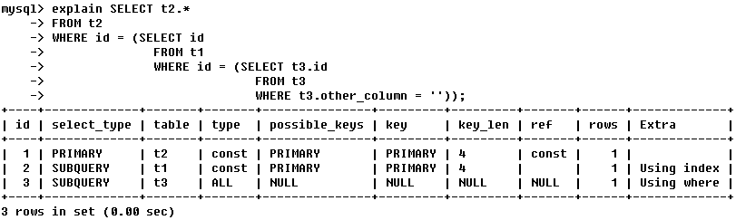
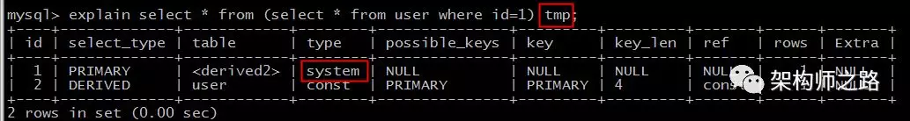

# 数据库13mysql执行计划
## EXPLAIN用法详解
举例：EXPLAIN SELECT ……

变体： 1. EXPLAIN EXTENDED SELECT ……将执行计划“反编译”成SELECT语句，运行SHOW WARNINGS 可得到被MySQL优化器优化后的查询语句




### id
select 查询的序列号，标识执行的顺序

```
id 相同，执行顺序由上至下
id 不同，如果是子查询，id 的序号会递增，id 值越大优先级越高，越先被执行
```

### select_type

查询的类型，主要是用于区分普通查询、联合查询、子查询等。

```
SIMPLE：简单的 select 查询，查询中不包含子查询或者 union
PRIMARY：查询中包含子部分，最外层查询则被标记为 primary
SUBQUERY/MATERIALIZED：SUBQUERY 表示在 select 或 where 列表中包含了子查询，MATERIALIZED：表示 where 后面 in 条件的子查询
UNION：表示 union 中的第二个或后面的 select 语句
UNION RESULT：union 的结果
```

### table

查询涉及到的表。

```
直接显示表名或者表的别名
<unionM,N> 由 ID 为 M，N 查询 union 产生的结果
<subqueryN> 由 ID 为 N 查询产生的结果
```

### type

访问类型，SQL 查询优化中一个很重要的指标，结果值从好到坏依次是：system > const > eq_ref > ref > range > index > ALL。**查询至少达到range级别，最好能达到ref**。

```
system：系统表，少量数据，往往不需要进行磁盘IO
const：常量连接,PK 或者 unique 上的等值查询
eq_ref：主键索引（primary key）或者非空唯一索引（unique not null）等值扫描
ref：非唯一索引，等值匹配，可能有多行命中
range：索引上的范围扫描，例如：between、in、>
index：索引上的全集扫描，例如：InnoDB 的 count
ALL：全表扫描（full table scan）,
```
举例:

```
system:explain select * from mysql.time_zone;
从系统库 MySQL 的系统表 time_zone 里查询数据，访问类型为 system，这些数据已经加载到内存里，不需要进行磁盘 IO，这类扫描是速度最快的

explain select * from (select * from user where id=1) tmp;

```


再举一个例子，内层嵌套（const）返回了一个临时表，外层嵌套从临时表查询，其扫描类型也是 system，也不需要走磁盘 IO，速度超快。


const 扫描的条件为：

```
命中主键（primary key）或者唯一（unique）索引
被连接的部分是一个常量（const）值 
```
如上例，id 是 主键索引，连接部分是常量1。


eq_ref 扫描的条件为，对于前表的每一行（row），后表只有一行被扫描。

再细化一点：

```
join 查询
命中主键（primary key）或者非空唯一（unique not null）索引
等值连接；
```

ref 扫描，可能出现在 join 里，也可能出现在单表普通索引里，每一次匹配可能有多行数据返回，虽然它比 eq_ref 要慢，但它仍然是一个很快的 join 类型。

range 扫描就比较好理解了，它是索引上的范围查询，它会在索引上扫码特定范围内的值。

index:该 count 查询需要通过扫描索引上的全部数据来计数，它仅比全表扫描快一点。
```
explain count (*) from user;
```

### possible_keys

指出MySQL能使用哪个索引在表中找到行，查询涉及到的字段上若存在索引，则该索引将被列出，但不一定被查询使用


### key

显示MySQL在查询中实际使用的索引，若没有使用索引，显示为NULL

TIPS：查询中若使用了覆盖索引，则该索引仅出现在key列表中


### key_len

表示索引中使用的字节数，可通过该列计算查询中使用的索引的长度


### ref

表示上述表的连接匹配条件，即哪些列或常量被用于查找索引列上的值


### rows

表示MySQL根据表统计信息及索引选用情况，估算的找到所需的记录所需要读取的行数


### Extra

十分重要的额外信息。

```
Using filesort：MySQL 对数据使用一个外部的文件内容进行了排序，而不是按照表内的索引进行排序读取。
典型的，在一个没有建立索引的列上进行了 order by，就会触发 filesort，常见的优化方案是，在 order by 的列上添加索引，避免每次查询都全量排序。

Using temporary：使用临时表保存中间结果，也就是说 MySQL 在对查询结果排序时使用了临时表，常见于order by 或 group by。
临时表存在两种引擎，一种是 Memory 引擎，一种是 MyISAM 引擎，如果返回的数据在 16M 以内（默认），且没有大字段的情况下，使用 Memory 引擎，否则使用 MyISAM 引擎。 

Using index：表示 SQL 操作中使用了覆盖索引（Covering Index），避免了访问表的数据行，效率高。
Using index condition：表示 SQL 操作命中了索引，但不是所有的列数据都在索引树上，还需要访问实际的行记录。
Using where：表示 SQL 操作使用了 where 过滤条件。
Select tables optimized away：基于索引优化 MIN/MAX 操作或者 MyISAM 存储引擎优化 COUNT(*) 操作，不必等到执行阶段再进行计算，查询执行计划生成的阶段即可完成优化。
Using join buffer (Block Nested Loop)：表示 SQL 操作使用了关联查询或者子查询，且需要进行嵌套循环计算。
```

## 关于MySQL执行计划的局限总结如下：
1.EXPLAIN不会告诉你关于触发器、存储过程的信息或用户自定义函数对查询的影响情况

2.EXPLAIN不考虑各种Cache

3.EXPLAIN不能显示MySQL在执行查询时所作的优化工作

4.部分统计信息是估算的，并非精确值

5.EXPALIN只能解释SELECT操作，其他操作要重写为SELECT后查看执行计划

## 对于非select语句查看执行计划
在实际的工作中也经常需要查看一些诸如update、delete的执行计划，（mysql5.6的版本已经支持直接查看）但是这时候并不能直接通过explain来进行查看，而需要通过改写语句进行查看执行计划；


## 参考
MySQL执行计划分析工具EXPLAIN用法详解：blog.chinaunix.net/uid-25723371-id-5598143.html

MYSQL查看执行计划：https://blog.51cto.com/xiaocao13140/2126580

MySQL 执行计划详解：https://www.cnblogs.com/yinjw/p/11864477.html

MySQL——执行计划(较好的案例列表，可作为练习手册)：https://www.cnblogs.com/sunjingwu/p/10755823.html

