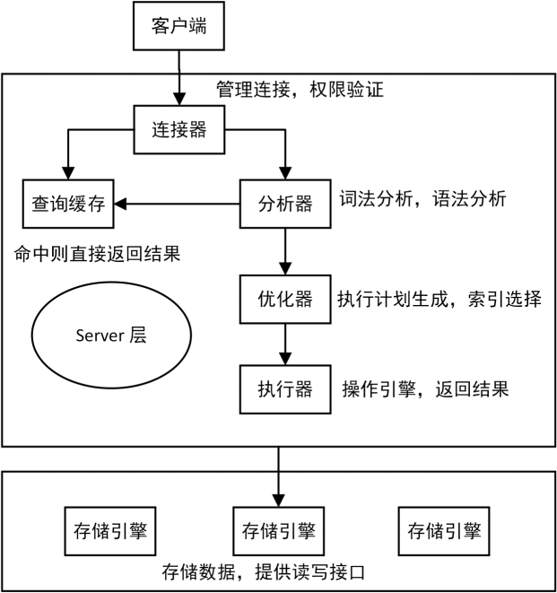
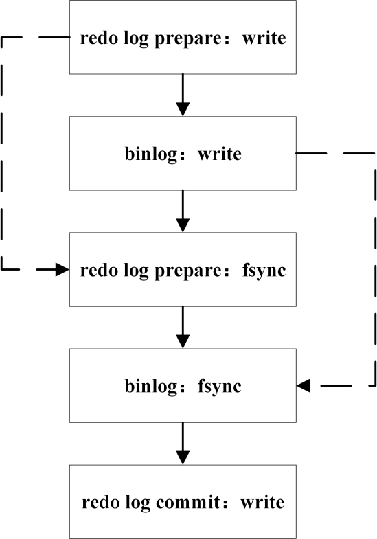
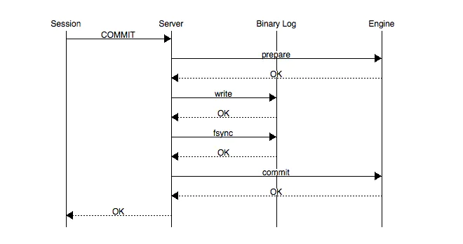

# 数据库14mysql的redolog与binlog
## SQL语句执行链路


##  什么是redo log？
redo log又称重做日志文件，用于记录事务操作的变化，记录的是数据修改之后的值，不管事务是否提交都会记录下来。在实例和介质失败（media failure）时，redo log文件就能派上用场，如数据库掉电，InnoDB存储引擎会使用redo log恢复到掉电前的时刻，以此来保证数据的完整性。


## 什么是binlog
binlog记录了对MySQL数据库执行更改的所有操作，但是不包括SELECT和SHOW这类操作，因为这类操作对数据本身并没有修改。然后，若操作本身并没有导致数据库发生变化(比如update但条件筛选后为0，实际没有真正update)，那么该操作也会写入二进制日志。


## redo log与binlog的区别
第一:**redo log是在InnoDB存储引擎**层产生，而**binlog是MySQL数据库的上层**产生的，并且二进制日志不仅仅针对INNODB存储引擎，MySQL数据库中的**任何存储引擎对于数据库的更改都会产生二进制日志**。

第二：两种日志记录的内容形式不同。**MySQL的binlog是逻辑日志**，其记录是对应的SQL语句。而**innodb存储引擎层面的重做日志是物理日志**。
第三：两种日志与记录写入磁盘的时间点不同，**二进制日志只在事务提交完成后进行一次写入**。而innodb存储引擎的重做日志**在事务进行中不断地被写入**，并日志不是随事务提交的顺序进行写入的。

二进制日志仅在事务提交时记录，并且对于每一个事务，仅在事务提交时记录，并且对于每一个事务，仅包含对应事务的一个日志。而对于innodb存储引擎的重做日志，**由于其记录是物理操作日志，因此每个事务对应多个日志条目，并且事务的重做日志写入是并发的，并非在事务提交时写入，其在文件中记录的顺序并非是事务开始的顺序**。

第四：**binlog不是循环使用**，在写满或者重启之后，会生成新的binlog文件，**redo log是循环使用**。

第五：**binlog可以作为恢复数据使用，主从复制搭建**，**redo log作为异常宕机或者介质故障后的数据恢复使用**。


## 两阶段提交（2PC）
MySQL 使用两阶段提交主要解决 binlog 和 redo log 的数据一致性的问题。

redo log 和 binlog 都可以用于表示事务的提交状态，而两阶段提交就是让这两个状态保持逻辑上的一致。下图为 MySQL 二阶段提交简图：



两阶段提交原理描述:

```
InnoDB redo log 写盘，InnoDB 事务进入 prepare 状态。
如果前面 prepare 成功，binlog 写盘，那么再继续将事务日志持久化到 binlog，如果持久化成功，那么 InnoDB 事务则进入 commit 状态(在 redo log 里面写一个 commit 记录)
备注: 每个事务 binlog 的末尾，会记录一个 XID event，标志着事务是否提交成功，也就是说，recovery 过程中，binlog 最后一个 XID event 之后的内容都应该被 purge。
```

Binlog在2PC中充当了事务的协调者（Transaction Coordinator）。由Binlog来通知InnoDB引擎来执行prepare，commit或者rollback的步骤。事务提交的整个过程如下：




由上面的二阶段提交流程可以看出，通过**两阶段提交方式保证了无论在任何情况下，事务要么同时存在于存储引擎和binlog中，要么两个里面都不存在，可以保证事务的binlog和redo log顺序一致性**。一旦阶段2中持久化Binlog完成，就确保了事务的提交。此外需要注意的是，每个阶段都需要进行一次fsync操作才能保证上下两层数据的一致性。阶段1的fsync由参数innodb_flush_log_at_trx_commit=1控制，阶段2的fsync由参数sync_binlog=1控制，俗称“双1”，是保证crash-safe的根本。


## redo log 和 binlog 是怎么关联起来的?
redo log 和 binlog 有一个共同的数据字段，叫 XID。崩溃恢复的时候，会按顺序扫描 redo log：

```
如果碰到既有 prepare、又有 commit 的 redo log，就直接提交；
如果碰到只有 parepare、而没有 commit 的 redo log，就拿着 XID 去 binlog 找对应的事务。
```

## 参考
MySQL redo log 与 binlog 的区别：https://blog.csdn.net/wanbin6470398/article/details/81941586

MySQL 日志系统之 redo log 和 binlog：https://www.cnblogs.com/yanglang/p/11758606.html

MySQL的Binlog与Redolog：https://www.jianshu.com/p/65eb0526bfc0

